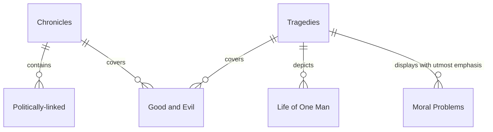

## I. Background

- Born on April 23, 1564 in Stratford-upon-Avon
- Went to Stratford Grammar School
  - Greek and Latin were almost the exclusive subjects
- Life + IRL contact + English folklore
- Possibly impressed by travelling actors in his hometown
- 18 years old: Married Anne Hathaway
  - Two daughters: Susana, 1583 and Judith, 1585
- Little is known during 1585-1592
  - "A Goatsworth of Wit" by [[Robert Green]] alludes to him as an actor and a playwright.
  - Probable that he moved to London in 1585 in pursuit of acting
- June 1592 - April 1594: London theaters closed due to the plague
  - Income from patron, Henry Wriothesley to whom he dedicated two poems: [[Venus and Adonis]] and [[The Rape of Lucrece]]
- 1594: Joined the Chamberlain's company of actors
- 1599: Joined a group of Chamberlain's Men
- While regarded as the foremost dramatist, he instead looked to poetry.
  - Composed sonnets between 1593-1601
    - Unpublished until 1609 as [[The Sonnets of Shakespeare]]
    - 154 sonnets, written in three quatrains couplet recognized as "Shakespearean"
- Wrote 37 plays divided into four categories:
  - Histories
  - Comedies
  - Tragedies
  - Romances
- Earliest plays primarily histories and comedies ([[Henry VI]], Comedy of Errors)
- 1596: [[R-meo and J-liet]]
- Over the next dozen years: Return to form via:
  - Julius Caesar
  - Hamlet
  - Othello
  - King Lear
  - Macbeth
  - Antony & Cleopatra
- Final years of life: turned to romance
  - Cymbeline
  - A Winter's Tale
  - The Tempest

## II. Career

- Only 18 plays were published seperately during his lifetime
  - Complete edition did not appear until [[The First Folio]]
- Contemporaries recognized his achievements
  - "Honey-tongued" - Francis Meres
  - Chamberlain's Men rose to lead drama in London, and became members of the royal household in 1603
    **- Author of 2 poems, 37 plays and 154 sonnets, divided into three periods:**

### 1. The First Period (1590 - 1600)

- Marked by characteristic optimism of all [Humanist](Humanism.md) literature
  - Best reflected in his nine ~~rings of hell~~ comedies:
    - Comedy of Errors
    - The Taming of the Shrew
    - The Two Gentlemen of Verona
    - Love's Labour Lost
    - A Midsummer Night's Dream
    - Much Ado About Nothing
    - The Merry Wives or Windsor
    - As You Like it
    - Twelfth Night; Or, What You Will
  - Adventures of young men and women, their friendship and love, their search for happiness
  - They showed the "merry England" of his time
  - Misunderstandings lead to comical situations
  - Not a mockery against the people - he laughs WITH the people, never AT them.
  - Filled with [Humanist](Humanism.md) love for people, belief in nobleness and kindness of human nature.
- Historical chronicles during the First Period:
  - List:
    - King Henry VI
    - The Tragedy of King Richard II
    - The LIfe and Death of King John
    - King Henry IV
    - The Life of King Henry V
  - Plays written on subjects of national history
  - Cover over 300 years of English history (12-16th century)
  - Main subjects are not kings, but the history during those kings' reigns and the development of the nation
  - Like [Humanists](Humanism.md) of his time, Shakespeare believed in a centralized monarchy.
  - His work covered kings, feudal, churchmen, and the lower class all the same.
- Late in the Period: Pessimistic turn
  - Merchant of Venice
  - [[R-meo and J-liet]]
  - Julius Caesar

### 2. The Second Period (1601 - 1608)

- Four great tragedies ~~as they grab on my thighs~~
  - List:
    - Hamlet
    - Prince of Denmark
    - Othello, the Moor of Venice
    - King Lear
    - Macbeth
  - Unsolvable contradictions of life, falsehood, injustice and tyranny.
  - Laments for those who perished in the face of evil
  - Based on real-life events, considerable difference in both

### 3. Third Period (1609 - 1612)

- Still touches(ngh) upon socio-moral problems
  - This time with utopian solutions!
- Introduces romantic-fantastic elements
  - List of romantic dramas during this time:
    - Cymbeline
    - The Winter's Tale
    - The Tempest

### 4. End of Life (1612 - 1616)

- Depth of humanism
  - Greatly appreciated by kindred minds of humanity
- Retirement in 1612, with his will written in January of 1616.
  #literature
  #author
