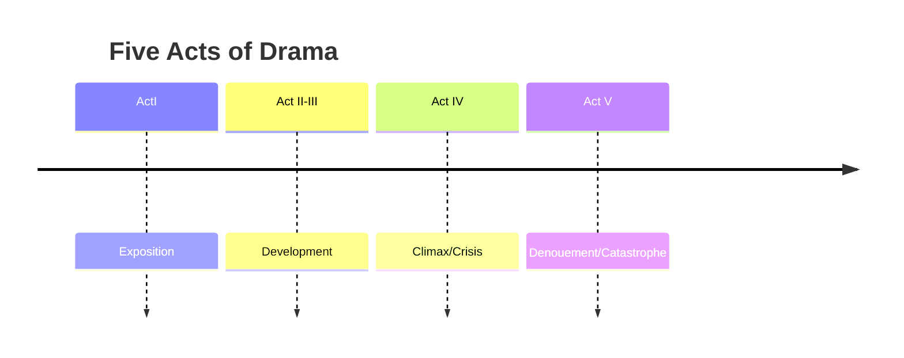

"Drama is a literary composition involving conflict, action crisis and atmosphere designed to be acted by players on a stage before an audience."

## A composite art

- Immitates life through action and speech
- Designed for representation on the stage
  - Actors act parts of the characters and distribute narrative and dialogue
- Closely bound up with:
  - Stage conditions
  - Actor skill
  - Audience tastes

## 4-part construction

- Generally divided into five acts:

## Characterisation:

- Brevity:
  - Must not be over-crowded
  - Attention confined to significant aspects
- Character development
  - Personal speeches
  - Monologues
  - Others' preceptions
  - Soliloques, asides
  - Character interactions
  - Inner/Outer conflict

## Language

- Verse and/or prose
  - Verse: Metrical or rhymed composition
  - Prose: Ordinary speech or writing, without metrical structures
- Brief, to-the-point dialogue
- Entirely objective
- Development through dialogue

## Themes

- Noble, dignified actions
- Ignoble and trivial commonly brought in for contrasts, satire,...
- Dramatist conveys through characters
- Criticism of life

## Forms of Drama:

- Tragedy
  - Classical, Romantic, Revenge, Sentimental, Heroic, etc...
- Comedy
  - Romantic, Classical, Humor, Manners, Farcical, etc...
- Tragicomedy

## Notable Writers:

[[William Shakespeare]] (...i mean, who else atp)
#literature
