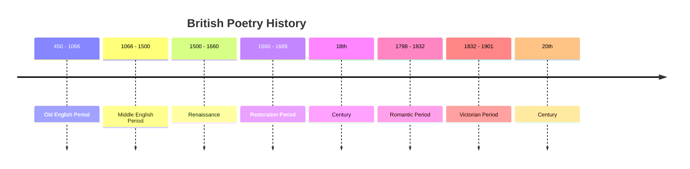

## I. Definition

- Piece of writing in which expression of feelings and ideas is given intensity by particular attention to diction, rhythm and imagery
- A product of the poet's imagination and the best words in the best order
- Spontaneous overflow of powerful feelings, expressions of emotion and is always concerned with ordinary human concerns, with daily matters of one's life

## II. Periods of British Poetry

### 1. Old English Period

- 5-6th century
- Anglo-Saxon invasion
- Of their earliest oral poetry, little to none survives.
- Late 7th century
- Caedmon, an illiterate Northumbrian cowherd, was inspired in a dream to compose a short hymn in praise of the creation ⇒ The Hymn of Creation 
- Others followed his example and thus, England was given an unrivaled scale in vernacular poetry before the end of the first millennium.
- Poetry format: 
  - Alliterative verse (Rhyming the initial consonant sounds): Written in a single meter, a four-stress line with a syntactical break between the second and third stresses with alliteration linking the two halves together
  - to feast his fill of the flesh of men” (the alliterative use of the letter ‘f’)
- Other standard devices:
  - Kenning: expressing a thing with a compound noun 
  - The brave warrior stood on the coast, admiring the whale-road. → Used whale-road instead of “the sea” 
  - Variation: repeating a single idea in different words and expressions
  - Jesus → Son of God → Our Lord and Savior… 
  - Little changes in 400 years → A display of extreme conservatism in Anglo-Saxon culture.
- Major manuscripts:
  - Most of the retained materials belonged in the 10th and 11th centuries.
  - Epic of Beowulf, Exeter Book, Caedmon Manuscripts, Vercelli Book,...
  - Old English literature was written right up to the Norman Conquest of 1066
    \=> Testament of English as a literary language with unparalleled polish and versatility among European vernaculars.

### 2. The Middle English Period (11th to 16th centuries)

- Norman conquest
- No immediate transformation on the English language + literature
- Older poetry continued to be copied during the latter parts of the  11th century
- 12th century: Durham and Instructions for Christians displayed the ability to compose alliterative texts correctly well past 1066.
- The shift in format
- Rhyming with the last letters in each line has begun to supplant rather than supplement alliteration.
- Post-conquest example: The Grave having more rhyme than alliteration.

> "Man, be mindful, of thy end,
>
> As thou hast life, so life shall wend.
>
> All that thou gatherest, and all that thou save,
>
> After thy death, thou nothing shall have.”

end / wend and save / have

- Poetry became dominated by brief, emotive lyric poems and chivalric romances.
- The French influence
- By the end of the 12th century, English poetry had been heavily imprinted by the Fr-nch models.
- Norman French became the language of the upper classes => exerted a big influence on the English tongue ⇒ Middle English.
- Most famous poet of the period: Geoffrey Chaucer with his “Canterbury Tales”

### 3. The Renaissance (16th to 17th centuries)

- A time of immense change in Britain:
  - The Reformation, the translations of the Bible into English, the growth of Humanism, and the birth of what would be the British Empire.
  - The age of Queen Elizabeth I, the sonnet, the pastoral poem and the theatre.
  - William Shakespeare (1564 - 1616) and Edmund Spenser (1552 - 1599) dominate the Elizabethan period
  - John Milton (1608 - 1674) marks a return to the religious concerns with his ‘Paradise Lost” → religious concerns find their way into the works of Metaphysical Poets, including John Donne (1573- - 1631)  and Andrew Marvell (1621-1678)

### 4. The Eighteenth Century

- Satire had risen to fame in poetry during this time 
- Alexander Pope (1688-1744) and Johnathan Swift (1667-1745) proved to be biting.
- “Augustan” is often used to describe other great poetic passion: translations of the great Classical Greek and Roman writers/poets (Homer, Horace, Juvenal)

### 5. The Romantics (18th to 19th centuries)

- Development of poetry
  - Home to many of the best-known English poets and poems.
  - Preoccupied with nature, authentic emotions and mortality ⇒ poets began to move away from the strict rules of meter and rhyme
  - Poetry began to thrive in creativity and soared into the Golden Age past the 18th century
- The great names of the period include:
  - William Blake (1757-1827)
  - Samuel Taylor Coleridge (1772-1834)
  - [[William Wordsworth]] (1770 - 1850)

### 6. The Victorian period (19th-20th centuries)

- Development of poetry
  - Continued many of the previous era’s main themes of religious skepticism and valorization of the artist as genius; but Victorian poets also developed a distinct sensibility.
- Victorian poetry is divided into two main groups:
  - The High Victorian Poetry - primarily written in the later half of Queen Victoria’s reign)
  - The Pre-Raphaelite Poetry - sought to revive the spirit of medieval art and literature, emphasizing a return to nature, beauty, and spiritual symbolism
- Poetry during this period relied on:
  - Sensory elements (imagery and the five senses to convey the struggles between Religion and Science - Nature and Romance.
  - Bohemian ideas were perpetuated and furthered the minds of Romantic Poetry

### 7. The 20th century

- Development of poetry
  - Poetry’s development could be split into three phases
  - First phase: Predominantly modernism, with its display methods being the thought-school of imagism and the dominance of war poetry.
  - Second phase: Initial manifestations of modernism combined to find a full nature expression in the poetry of T.S Eliot, Edith Sitwell,...
  - Third phase: Lasted throughout the 30s and marked by commentators of Marxism such as Auden, Louis McNiece, C.Day Lewis, …
- Poetry at this time did not share a surface-level characteristic, the themes ranged from realism, love, pessimism to nature, religion and mysticism.
- However, most products depicted a sense of disillusionment and a blurry picture of the future - postwar exhaustion.

## III. Classification:

- Lyric poetry (Thơ trữ tình):
- Elegy (Khúc bi thương), Ode (tụng ca), Sonnet
- Narrative poetry (Thơ tự sự):
- Epic (tráng ca), Ballad
- Cinquain (Thơ năm dòng)
- Limerick (Thơ hài)
- Diamante (Thơ bảy dòng)

### IV. Main features:

- Rhyme: The correspondence of sound between words, especially the endings of words in poetry.

> he stood in its wake,\
> the world’s line at stake.

- Rhythm: The stress patterns of each SYLLABLE in a line of poetry

> SOUND sleep by NIGHT, STUDY and EASE\
> toGEther MIXED, sweet REcreAtion\
> and INnoCENCE, which MOST does PLEASE\
> with MEdiTAtion.

- Mood: the general atmosphere or emotion existing throughout the poem.
  - Heightened emotions may be found in epics and somber, melancholic emotions are primarily present in odes, elegies.
- Stanzas: how each poem is divided into multiple sections in order to fit with the flow + narrative intended by the poet.
- Figurative language: Creating additional meanings beyond the words that are used.
  - This can be personification, hyperboles, symbolism,...
    #literature
    #Literature
