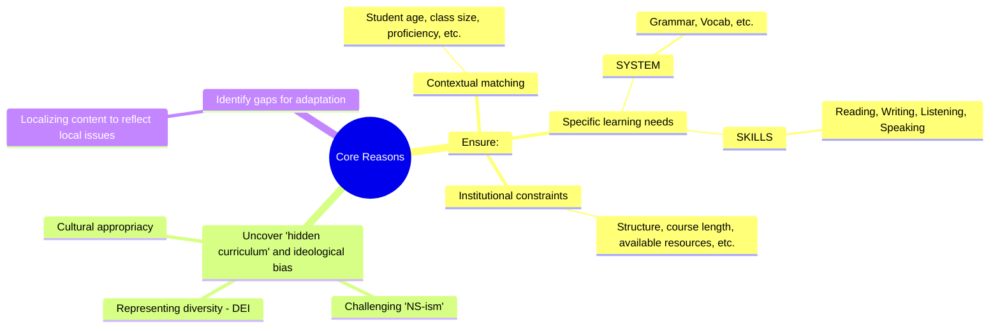

Reference: [[Unit 2 - Choosing a Coursebook.pdf]]

## I. Framework of analysis of CBs

- Coursebook (CB): One of the most important selections a teacher can make
- Choose coursebook for learners and oneself -> First need to analyze learner needs + personal needs

### 1. Nation's 4 strands:

#### a. Meaning-focused input

- Learners receive meaningful language (through receptive skills such as R + L)
  - Learning through listening and reading
  - Focus in on understanding the message

#### b. Meaning-focused output

- Learners produce meaningful language (through productive skills such as S + W)
  - Produce language to convey message to others (using largely familiar language)

#### c. Language-focused learning

- Learners work with language features (pronunciation, spelling, vocabulary, grammar, discourse)
  - Deliberate

#### d. Fluency development

- Learners work on receiving and conveying messages with which they are already familiar with; deal with language at higher speeds
  - Proficiency is priority, with increasing speeds

### 2. Hu and McKay's framework:

#### a. Description of English Users

- Examines who is depicted using English + patterns of communication between them (VN - VN, VN - non-Asian)

#### b. Portrayal of Multicultural Communication

- Presence of accommodation strategies, such as clarification requests or code-switching

#### c. Language + Cultural Ideology

- Evaluates whether materials promote NS-ism or Multilingualism

#### d. Problems

- 99% production require students to interact only with their VN classmates
- "Idealized version of intercultural encounters"
- Propagating NS-ism

## II. Why should CBs be evaluated?

> “Evaluating textbooks is essential because these materials are often treated as syllabus, exerting a massive influence on the goals, content, and methods used in a classroom.”
> -(Richard, 2014)

## III. Evaluating a CB

### 1. Procedure

Needs analysis -> Pick materials

### 2. Criteria

#### a. Stakeholder needs + Local contexts

| Learner factors                                                                                            | Teacher factors                                                                                 | Institutional constraints                                                            |
| ---------------------------------------------------------------------------------------------------------- | ----------------------------------------------------------------------------------------------- | ------------------------------------------------------------------------------------ |
| - student age 	- proficiency 	- L.E experience 	- motivations 	- Culturally appropriate topics | - Preferred pedagogical approach 	- Training level 	- Guidance and support from materials | - cost 	- availability (access to computers, whiteboards,...) 	- course length |

#### b. Pedagogical + Curricular Alignment

- 4 strands
  - Meaning-focused input
  - Meaning-focused output
  - Language-focused learning
  - Fluency development
- Examination requirements
  - Band descriptors
  - Certifications
- Authenticity
  - Constructed language
  - Authentic language

## IV. Choosing a coursebook

### 1. What do you want from a coursebook?

- Teachers want different things, use in different ways
  - Some want a CB to provide everything
  - Some want to control and plan their own lessons and syllabus - CB becomes a library of materials from which they can choose to be used at their disposal

### 2. What can a good CB give the teacher?

- Clear timeline with proper sequencing + structuring for progressive revision
- Wide range of materials
- Security
- Source of ideas
- Student-oriented work
- Basis for homework and discussion
- etc.

### 3. What do learners need from a coursebook?

- What do they **want** from a CB?
  - Color and interest
  - Excitement and entertainment
- ...But what do they _**need**_ from a CB?
  - An accessible and understandable record of their work
  - Progress, purpose
  - Security, independence
  - Reference for check + revision

### 4. Core reasons:

- Uncover "hidden curriculum", ideological bias
- Identify gaps for **necessary adaptation**
  - No single textbook is perfect
  - Content should be localized

## V. Using + Adapting the CB

### 1. CB use in the classroom

- Teacher use / perception of a CB
  - Recipe
  - Springboard
  - Straitjacket
  - Textbook prescribed reminiscent of medicine -> How to use them, rather than whether to use them at all
- Student use
  - Major English input -> Learner's independence

### 2. Strategies for adaptation

#### a. Localizing content

#### b. Modifying tasks and focus

#### c. Reorganizing

**There will always be a compromise - things you won't like about a CB**
**- How important are they?**
**- Can substitutions be made?**
**- Anything missing - and can it be filled?**

> [!TIP] Remember
> Work in partnership with your coursebook. **Never** expect the CB to do everything for you, personalization is nothing if not mandatory in teaching.

#manageclass #elt
