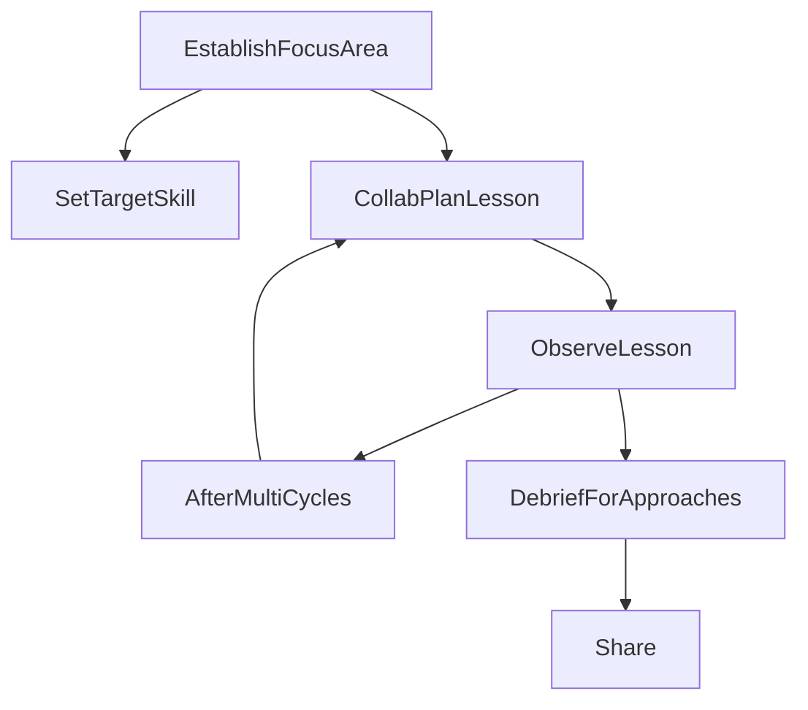

## I. What is "Lesson Study"?

- Japanese-originated approach to examining classroom practice
- Places teachers at the forefront of professional development initiatives, amining to comprehend the learning needs of their students
- Teachers focus on a specific aspect through:
  - Designing, teaching, observing and assessing lessons centered around that aspect
- Also known as a framework for collaborative design and research that places a strong emphasis on teacher leadership towards improved teaching, fostering interactions among students in the classroom and personalizing student needs
- Subjects and objectives are chosen as focus within a certain timeframe
  -> Comprehensive developmental plan that incorporates a specific research lesson as an integral component of an in-depth investigation

## II. Different levels of lesson study

- 3 levels of lesson study: **School, district, and national level**
  - **School-based lesson study** aims to address a school-wide research theme.
  - **District-level lesson study** is often for schools to share learning with other schools, with research lessons held at each grade and representatives from attendance from representatives.
  - **National-level lesson study** is done at a major conference, meant to explore new content, viewpoints and present new approaches to education.

## III. Lesson Study Model

## Relevant documents:

- [Using lesson study for teacher development: A case study of Vietnamese EFL teachers' reflections](https://ctujs.ctu.edu.vn/index.php/ctujs/article/view/626/667)
- [Wikipedia article about lesson study](https://en.wikipedia.org/wiki/Lesson_study)

#selfgrowth
#elt
