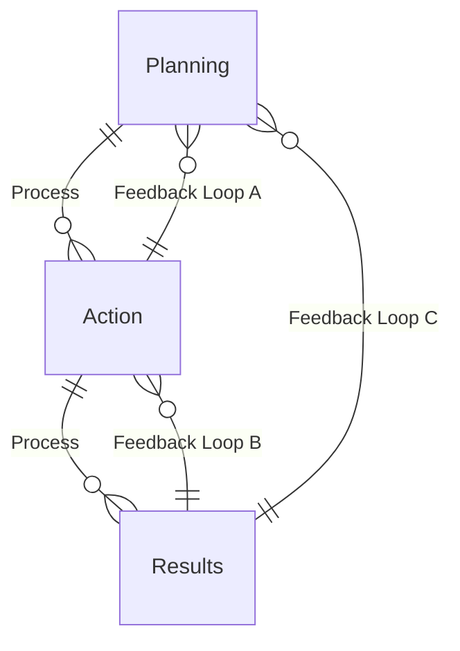

## I. Nature of Action Research

- Teacher-conducted classroom research that seeks to clarify + resolve practical teaching issues and problems
- Refers to two dimensions:
  - Researcher
  - Teacher
- Potential benefits:
  - Better understanding of student behavior
  - The nature of Taking action + Research at the same time
  - Practical + Live feedback
- Cycle:

- Interview: [Is there a place for classroom research in the busy lives of teachers?](https://resig.weebly.com/uploads/2/6/3/6/26368747/002_cao_advance_publication.pdf)

## II. Purpose and benefits of action research

### Why add research?

- Advocates suggest a misunderstanding of "action research".
  - As it is research based on teaching, it is best thought of as adding a research dimension to existing practice -> better understand + improve such practice.
  - Equip teachers with the means to set their own agendas for improvement and shift responsibility for change to teachers themselves.

### Vignette

- Two questions prompted investigation: Homework and student-teacher interaction
  - Students didn't finish homework
  - Teacher complaints that students were reluctant to interact during class
- Solutions:
  - Questionnaire for student activities, schedules and free-time activities - in L1
  - Results went against common perceptions of constant study and little time for extracurricular activities
  - Students had ample time for gaming, sports, etc. - "killing time"
  - Homework policy saw changes according to responses -> completion rates improved to 90%
  - Another positive effect was the introduction of workshops in teacher-training meetings -> increased motivation and participation
- Why the positive results?
  - Questionnaire prompted students to feel important - they believe we're truly interested in them as real people and not as robotic students
  - While results are not applicable to everyone, it mattered in the conductor's context

## III. Procedures used for conduction action research

- Usually consists of a number of phases in cycles:
  - **Planning**
  - **Action**
  - **Observation**
  - **Reflection**
- Burns expanded into a cycle of 11 events:
  - **Exploring** (finding an issue)
    - Action research begins with a concern about his/her classes or an issue the teacher would like to explore + learn about
    - Should be fairly readily explored + likely to lead to practical follow-ups
  - **Identifying** (analyzing the issue in detail)
    - Once it's been identified, it needs to be made more specific to be part of the project -> Turning into a more specific question, usually focused on some aspect of teaching, learner behavior or use of materials
  - **Planning** (what kind of data to collect + how to collect it)
    - Can the issue be explored on its own? Or is it better as a collaborative project?
  - **Collecting data** (through aforementioned methods)
    - Two points where data needs to be collected: Before and After the research strategy
    - Many different methods: Notes, Diaries, Recordings, Transcripts, Interviews, Questionnaires,...
  - **Analyzing/reflecting** ( analyzing data)
    - Sift through the data to find out what the most important, relevant themes from it
  - **Hypothesizing/speculating** ( arriving at a certain level of understanding based on the data)
  - **Intervening** (changing classroom practice based on the hypothesis one arrived at)
    - Teacher may change the way they teach, the materials they use, or the forms of assessment
  - **Observing** (observing what happened as a result of the changes)
    - Compare results after change to results prior to the change
  - **Reporting** (describing what has been observed)
  - **Writing** (writing up the results)
  - **Presenting** (presenting findings to other teachers)

### Vignette : Teaching program for individualized learning

- Increasingly aware of frustration from students unable to describe themselves due to a lack of vocabulary.
- Competence in general English was irrelevant, specific-purpose English was consistently lacking
- Adopted a teaching approach aiming to develop vocabulary based on the topic students chose
  - Students would choose a specific area they wanted to develop through independent study
  - Ensure students could get access to resources - visual materials, dictionaries, technical books, textbooks,...
  - Students were responsible for their own learning
- Offered 3 classroom sessions with the teacher which drew attention to vocabulary definitions and categories, verbs and phrases, and words + clauses in context
  - Outside activities to make use of community services
- Fourth session to present their work to others in the class
- Monitored responses as data collection: through discussions with individual students and her own observations
- Questionnaire to survey students on where they got their new vocabulary from
- Claimed that students became more confident in taking responsibility for ESP vocabulary development once they're given a starting point + strategies.

### Implementing action research

- Key questions in mind:
  - **Purpose:** Why am I starting this project?
  - **Topic:** What issue will I investigate?
  - **Focus:** How can I narrow down the issue to investigate to make it manageable?
  - **Mode:** How can this research be conducted? What data-collecting methods can be used and why?
  - **Timing:** How much time?
  - **Resources:** What is available to me?
  - **Product:** What is the likely outcome of the research?
  - **Action:** What will I do as a result of conducting this research?
  - **Reporting:** How will I share the findings?

## Relevant documents:

- [Textbook about Professional Development](https://drive.google.com/file/d/1STc5AZV_wbyelw_Otemxh1HdH9zWF9n4/view)
  #selfgrowth
  #elt
